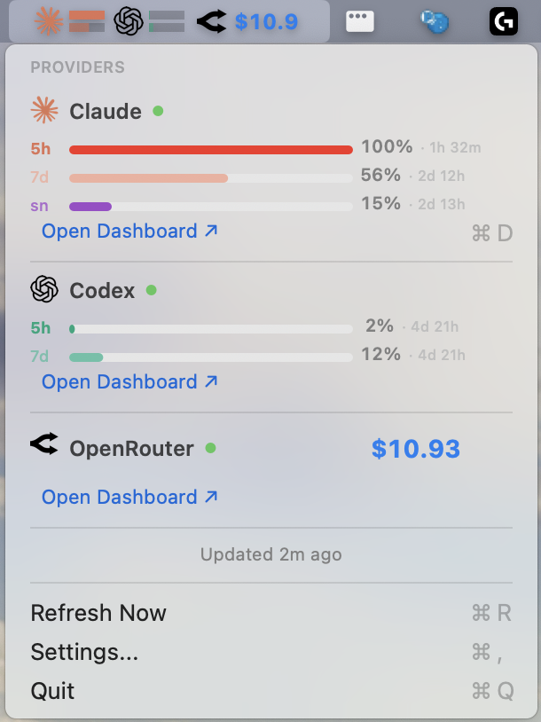

# AIUsageMonitor

<!-- MIRROR: keep section order aligned with README_EN.md -->

<div align="center">
  
</div>

<div align="center">
  <h1>WORK UNTIL USAGE IS EXHAUSTED.</h1>
</div>

AIUsageMonitor는 Claude, Codex, Copilot, Gemini, OpenRouter 사용량을 macOS 메뉴바에서 한눈에 보여주는 앱입니다.

[English README](README_EN.md)




## Quick Start

### 1) 설치

```bash
git clone https://github.com/hichoe95/AI_Provider_Usage_monitor_for_mac.git
cd AI_Provider_Usage_monitor_for_mac
./install.sh
```

`install.sh`가 자동으로 처리합니다.
- release 빌드 -> 앱 설치 -> 실행
- 단계별 스피너/애니메이션 진행 로그
- 설치 로그 파일: `${TMPDIR:-/tmp}/usagemonitor-install.log`
- 설치 경로: `/Applications` (권한 없으면 `~/Applications`)

### 2) 첫 실행 세팅

1. 앱이 실행되는 **로컬 Mac 터미널**에서 provider 로그인
2. 메뉴바 아이콘 -> `Settings...`에서 필요한 provider ON
3. `Refresh Now` (`⌘R`) 클릭

CLI 로그인 명령은 버전에 따라 다를 수 있으니 `--help`로 확인하세요.

```bash
claude --help
codex --help
gh --help
gemini --help
```

### 3) 알림 설정 (필수)

1. `Settings...` -> `Notifications` 이동
2. `Enable usage alerts` ON
3. `Request permission` 클릭
4. 상태가 `Notifications: Allowed`인지 확인
5. `Send test alert`로 실제 배너 확인

`Denied`로 보이면 macOS `시스템 설정 -> 알림 -> AIUsageMonitor`에서 허용하세요.

## Features

- provider별 사용량 바: `5h`, `7d` (Claude는 `sn` 포함)
- 각 바의 남은 시간: `2h 15m`, `3d 4h`
- 상태 점, 트렌드(`↑`/`↓`), `Open Dashboard ↗`, `Updated ... ago`

## Shortcuts

- `⌘R`: Refresh Now
- `⌘,`: Settings
- `⌘D`: Claude Dashboard
- `⌘Q`: Quit

## 업데이트 / 삭제

**업데이트**

```bash
cd AI_Provider_Usage_monitor_for_mac
git pull
./install.sh
```

**삭제**

```bash
cd AI_Provider_Usage_monitor_for_mac
./uninstall.sh
```

<details>
<summary>수동 삭제</summary>

```bash
rm -rf /Applications/AIUsageMonitor.app
# 또는 ~/Applications에 설치된 경우
rm -rf ~/Applications/AIUsageMonitor.app
defaults delete com.choihwanil.usagemonitor 2>/dev/null || true
rm -rf ~/Library/Application\ Support/UsageMonitor
rm -rf ~/Library/Caches/com.choihwanil.usagemonitor ~/Library/Caches/UsageMonitor
```

</details>

## Troubleshooting

### 1) `No data`만 보일 때

- 로그인한 터미널 계정과 앱 실행 계정이 같은지 확인
- 로컬 Mac에서 provider 로그인 다시 진행
- `Refresh Now` 실행

### 2) Keychain 팝업이 반복될 때

- 팝업에서 `Always Allow` 선택
- 이미 `Allow`만 눌렀다면 Keychain Access에서 권한을 `Always Allow`로 변경

### 3) OpenRouter가 안 뜰 때

- Settings에서 OpenRouter ON
- API key 저장 후 `Refresh Now`

### 4) `swift` 명령이 없을 때

```bash
xcode-select --install
```

### 5) 설치 중 오류가 날 때

- 로그 확인: `cat ${TMPDIR:-/tmp}/usagemonitor-install.log`
- 마지막 에러 줄부터 원인 확인
- 반복되면 로그 전체를 이슈에 첨부

### 6) Swift/SDK 버전 불일치 오류가 날 때

```bash
sudo xcode-select -s /Applications/Xcode.app/Contents/Developer
sudo xcodebuild -runFirstLaunch
```

- 에러 예시: `SDK is built with ... while this compiler is ...`
- 위 설정 후 `./install.sh` 재실행

### 7) 실행이 안 되거나 설치 경로가 꼬였을 때

```bash
rm -rf /Applications/AIUsageMonitor.app ~/Applications/AIUsageMonitor.app
./install.sh
```

- 앱을 한 경로에만 설치해 중복 설치 혼선을 제거

### 8) 아이콘이 바로 안 바뀔 때

- 앱 종료 후 재설치
- Finder/Dock 아이콘 캐시 지연 때문에 잠깐 이전 아이콘이 보일 수 있음

## Requirements

| 항목 | 최소 요구사항 |
|---|---|
| OS | macOS 14 이상 |
| Xcode | 16 이상 (Swift 6 포함) |
| Git | 설치 필요 |
| 네트워크 | API 조회에 필요 |

확인 명령:

```bash
swift --version
git --version
```

## Development

```bash
swift build
swift test
./Scripts/package_app.sh
GOOGLE_GENERATIVE_AI_API_KEY=... python3 Scripts/generate_icon_with_gemini.py --output Assets/icon-gemini-raw.png
```

## FAQ

### 왜 DMG 대신 소스 설치를 권장하나요?

다운로드된 DMG 앱은 macOS Gatekeeper 정책 때문에 실행 차단될 수 있습니다.
로컬에서 직접 빌드/설치하면 실행 문제가 가장 적습니다.

## 변경 로그

### 2026-02-13 (최신)

- 앱 이름을 `AIUsageMonitor`로 통합 (product/bundle/script/UI 문자열 정리)
- 패키징/설치 스크립트에서 실행 파일명과 앱 번들명 불일치 문제 수정
- 패키징 스크립트에서 Xcode toolchain 자동 선택 + module cache 경로 보정
- 앱 시작 시 캐시 폴더 처리 안정화 (실행/네트워크 캐시 오류 완화)
- Codex 드롭다운 5h/7d 남은 시간 분리 표시 로직 보강
- Codex 파서에 `rate_limit.primary_window`/`secondary_window` + `reset_at`/`reset_after_seconds` 지원 추가
- Codex 사용량 파싱 오탐(100% 고정) 방지 로직 추가
- 앱 아이콘 비율 확대 및 `.icns` 재생성
- status bar 게이지 바 모서리 둥글게 렌더링
- README KR/EN 동기화 및 상단 아이콘 크기(256x256) 조정

<details>
<summary>이전 변경 내역</summary>

### 2026-02-12

- release 패키징 정리
- Swift 6 actor isolation 빌드 오류 수정
- Codex auth 오류 수정
- status bar 길이 조정
- README 업데이트

</details>

## License

MIT License
