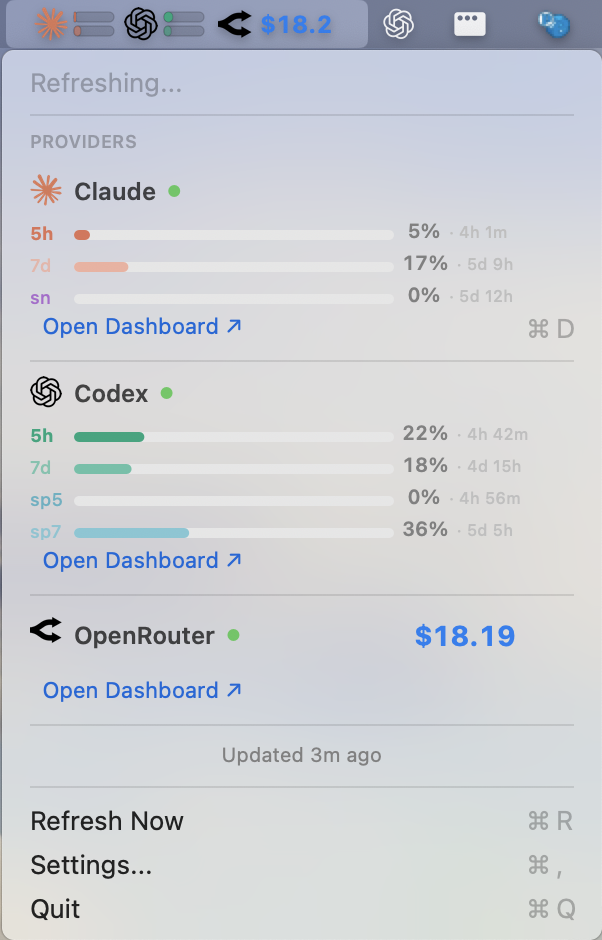

# AIUsageMonitor

<!-- MIRROR: keep section order aligned with README_EN.md -->

<div align="center">
  

  <h1>AIUsageMonitor</h1>

  <p><strong>WORK UNTIL USAGE IS EXHAUSTED.</strong></p>

  <p>Claude, Codex, Copilot, Gemini, OpenRouter 사용량을<br/>macOS 메뉴바에서 한눈에 확인하세요.</p>

  <p>
    <a href="README_EN.md">English</a>&nbsp;&nbsp;|&nbsp;&nbsp;한국어
  </p>

  <p>
    
    
    
  </p>

  
</div>

---

## 왜 필요한가요?

AI 코딩 도구(Claude Code, Codex, Copilot 등)를 쓰다 보면 **사용량 한도에 걸려서 작업이 멈추는 순간**이 옵니다.
그때서야 대시보드를 열어보면 이미 늦습니다.

AIUsageMonitor는 **메뉴바에서 실시간으로** 각 provider의 사용량을 보여줍니다.
한도에 가까워지면 알림을 보내, 작업 흐름이 끊기기 전에 대비할 수 있습니다.

---

## 주요 기능

| 기능 | 설명 |
|---|---|
| **실시간 사용량 바** | provider별 5시간/7일 사용량을 게이지 바로 표시 |
| **남은 시간 표시** | 각 구간의 리셋까지 남은 시간 (`2h 15m`, `3d 4h`) |
| **Codex Spark 사용량** | Codex의 Spark 모델 별도 사용량 추적 |
| **상태 트렌드** | 사용량 증감 트렌드 화살표 (`↑` / `↓`) |
| **사용량 알림** | 설정한 임계치 도달 시 macOS 알림 |
| **OpenRouter 잔액** | 남은 크레딧을 달러 단위로 표시 |
| **대시보드 바로가기** | 메뉴에서 클릭 한 번으로 각 provider 대시보드 이동 |

**지원 Provider:**

| Provider | 인증 방식 | 표시 정보 |
|---|---|---|
| Claude Code | OAuth (Keychain) | 5h, 7d, Sonnet 사용량 |
| Codex (OpenAI) | OAuth (`~/.codex/auth.json`) | 5h, 7d, Spark 사용량 |
| Copilot | GitHub CLI (`gh`) | 사용량 |
| Gemini | Google OAuth / API Key | 사용량 |
| OpenRouter | API Key | 잔액 ($) |

---

## 설치

```bash
git clone https://github.com/hichoe95/AI_Provider_Usage_monitor_for_mac.git
cd AI_Provider_Usage_monitor_for_mac
./install.sh
```

`install.sh`가 빌드부터 설치, 실행까지 자동으로 처리합니다.

> **요구사항:** macOS 14+, Xcode 16+ (Swift 6), Git

<details>
<summary>설치가 안 될 때</summary>

```bash
# Xcode CLI 도구 없을 때
xcode-select --install

# Swift/SDK 버전 불일치 시
sudo xcode-select -s /Applications/Xcode.app/Contents/Developer
sudo xcodebuild -runFirstLaunch

# 설치 로그 확인
cat ${TMPDIR:-/tmp}/usagemonitor-install.log
```

</details>

---

## 초기 설정 (필수)

### 1. Provider 로그인

앱이 실행되는 **로컬 Mac 터미널**에서 각 provider에 로그인하세요.

```bash
claude login        # Claude Code
codex login         # Codex (OpenAI)
gh auth login       # Copilot (GitHub)
gemini auth         # Gemini
```

> CLI 명령은 버전에 따라 다를 수 있으니 `--help`로 확인하세요.

### 2. Provider 활성화

메뉴바 아이콘 → `Settings...` → 사용할 provider ON → `Refresh Now` (`⌘R`)

### 3. 알림 설정

1. `Settings...` → `Notifications` → `Enable usage alerts` ON
2. `Request permission` 클릭 → `Notifications: Allowed` 확인
3. `Send test alert`로 배너가 뜨는지 확인

> `Denied`로 보이면 macOS **시스템 설정 → 알림 → AIUsageMonitor**에서 허용하세요.

---

## 인증 토큰 관리

각 provider마다 로그인 유지 기간이 다릅니다.

| Provider | 로그인 유지 기간 | 비고 |
|---|---|---|
| **Claude Code** | **8~12시간** | 하루에 1~2회 재로그인 필요 |
| Codex (OpenAI) | ~10일 | 자동 갱신 |
| Copilot | GitHub 로그인 유지 | `gh auth login` |
| Gemini | Google 로그인 유지 | `gemini auth` |

### ⚠️ Claude Code: 매일 로그인이 풀린다면 (필독)

Claude Code는 **8~12시간마다 인증이 만료**되고, macOS에서 자동 갱신이 실패하는 경우가 많습니다.
([관련 이슈](https://github.com/anthropics/claude-code/issues/19456))

**`setup-token`으로 장기 토큰을 발급받으면 해결됩니다:**

```bash
# 1. 장기 토큰 발급 (브라우저 인증 창이 열림)
claude setup-token

# 2. 출력된 토큰을 셸 설정에 등록
#    zsh (기본 셸):
echo 'export CLAUDE_CODE_OAUTH_TOKEN="출력된_토큰"' >> ~/.zshrc && source ~/.zshrc

#    bash:
echo 'export CLAUDE_CODE_OAUTH_TOKEN="출력된_토큰"' >> ~/.bashrc && source ~/.bashrc
```

> Pro/Max 구독자만 사용 가능합니다.

---

## 단축키

| 단축키 | 동작 |
|---|---|
| `⌘R` | 새로고침 |
| `⌘,` | 설정 |
| `⌘D` | Claude 대시보드 |
| `⌘Q` | 종료 |

---

## 업데이트 / 삭제

```bash
# 업데이트
cd AI_Provider_Usage_monitor_for_mac
git pull && ./install.sh

# 삭제
cd AI_Provider_Usage_monitor_for_mac
./uninstall.sh
```

<details>
<summary>수동 삭제</summary>

```bash
rm -rf /Applications/AIUsageMonitor.app ~/Applications/AIUsageMonitor.app
defaults delete com.choihwanil.usagemonitor 2>/dev/null || true
rm -rf ~/Library/Application\ Support/UsageMonitor
rm -rf ~/Library/Caches/com.choihwanil.usagemonitor ~/Library/Caches/UsageMonitor
```

</details>

---

## 문제 해결

| 증상 | 해결 |
|---|---|
| `No data`만 보임 | 터미널에서 provider 재로그인 후 `⌘R` |
| Keychain 팝업 반복 | 팝업에서 `Always Allow` 선택 |
| OpenRouter 안 뜸 | Settings에서 ON + API key 저장 |
| 아이콘 안 바뀜 | 앱 종료 후 재설치 (Finder 캐시 지연) |
| 설치 경로 꼬임 | `rm -rf /Applications/AIUsageMonitor.app ~/Applications/AIUsageMonitor.app` 후 재설치 |

---

## FAQ

**Q. 왜 DMG 대신 소스 설치를 권장하나요?**

다운로드된 DMG 앱은 macOS Gatekeeper에 의해 차단될 수 있습니다.
로컬에서 직접 빌드하면 이 문제가 없습니다.

---

## 개발

```bash
swift build
swift test
./Scripts/package_app.sh
```

---

## 변경 로그

### 2026-02-20 (최신)

- Codex status bar 아이콘을 ChatGPT 블로섬 로고로 교체 (드롭다운은 기존 로고 유지)
- OpenRouter 로고를 lobehub Avatar 스타일로 업데이트

<details>
<summary>2026-02-15</summary>

- Codex Spark 모델 사용량 추적 추가 (5h/7d 별도 표시)
- Claude OAuth 토큰 만료 후 키체인 재읽기 차단 버그 수정
- provider 에러 시 stale 데이터 클리어 (status bar 오버레이 방지)
- 에러→복구 전환 시 trend 화살표 소실 방지
- provider 에러 발생 시 status bar 아이콘-메뉴 동기화 수정
- 인증 토큰 관리 가이드 추가 (Claude `setup-token` 해결법)

</details>

<details>
<summary>2026-02-13</summary>

- 앱 이름 `AIUsageMonitor`로 통합
- 패키징/설치 스크립트 실행 파일명·앱 번들명 불일치 수정
- Xcode toolchain 자동 선택 + module cache 경로 보정
- 앱 시작 시 캐시 폴더 처리 안정화
- Codex 5h/7d 남은 시간 분리 표시 로직 보강
- Codex 파서에 `primary_window`/`secondary_window` + `reset_at`/`reset_after_seconds` 지원
- Codex 사용량 파싱 오탐(100% 고정) 방지
- 앱 아이콘 확대 및 `.icns` 재생성
- status bar 게이지 바 모서리 둥글게 렌더링

</details>

<details>
<summary>2026-02-12</summary>

- release 패키징 정리
- Swift 6 actor isolation 빌드 오류 수정
- Codex auth 오류 수정
- status bar 길이 조정

</details>

---

## License

[MIT License](LICENSE)
