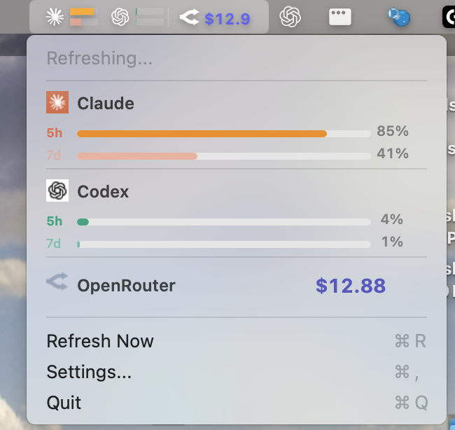
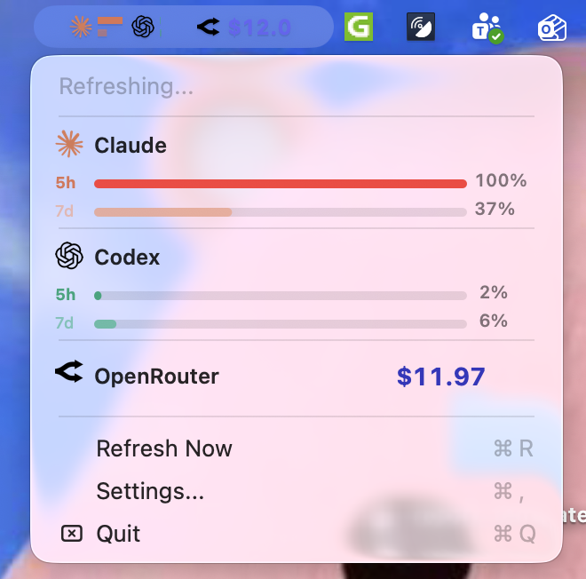

# UsageMonitor

Native macOS menu bar app for monitoring Claude, Codex, Copilot, Gemini, and OpenRouter usage.

[한국어 README](README.md)




## Screenshots

### Default App View



### Notification Example


## Features

- Menu bar usage indicators (5h / 7d style gauges)
- OpenRouter remaining credits ($)
- Per-provider on/off, refresh interval, alert thresholds
- Keychain/local auth-session based data collection

## Requirements

- macOS 14+
- Swift 6.0 toolchain (`swift --version`)
- Network access

## Quick Start

### 1) Run from source

```bash
git clone https://github.com/<YOUR_ACCOUNT>/AI_provider_usage_monitor.git
cd AI_provider_usage_monitor
swift build
./Scripts/package_app.sh
open UsageMonitor.app
```

### 2) Install with script

```bash
./Scripts/install_app.sh
```

What the install script does:

1. Build release binary
2. Create `UsageMonitor.app`
3. Copy to `/Applications` (or `~/Applications` if needed)
4. Launch the app

## Why auth login is required

UsageMonitor calls each provider's usage API directly. Those APIs require identity/authentication (OAuth token or API key). Without valid auth credentials, the app cannot fetch usage data and will show `No data` or auth errors.

## Where should I run auth login?

Short answer: **run auth login in the terminal on the same local Mac where UsageMonitor is running**.

Why:

- UsageMonitor reads auth data from the current local macOS user context:
  - `~/.claude`, `~/.codex`, `~/.copilot`, `~/.gemini`
  - macOS Keychain
- If you log in on a remote server (SSH/cloud/devcontainer), credentials are stored on that server.
- The macOS menu bar app on your local machine cannot automatically use server-side auth files/keychain.

So even if most development happens on servers, you should still run provider auth login locally for UsageMonitor.

If a Keychain access prompt appears, choose **`Always Allow`**. If you choose only `Allow`, the prompt may appear repeatedly on future refreshes.

## Auth sources by provider

### Claude Code

Priority:

1. Keychain `Claude Code-credentials`
2. `~/.claude/.credentials.json`
3. `~/.claude/auth.json`

### Codex

- Uses OAuth token from `~/.codex/auth.json`
- Requires an active Codex CLI login session

### Copilot

Priority:

1. `GH_TOKEN` / `GITHUB_TOKEN` / `COPILOT_TOKEN`
2. Keychain `copilot-access-token`
3. `~/.copilot/config.json`
4. `~/.config/github-copilot/apps.json`
5. `~/.config/github-copilot/hosts.json`
6. `~/.config/gh/hosts.yml` (`oauth_token`)

### Gemini

Priority:

1. OAuth files like `~/.gemini/oauth_creds.json`
2. `GEMINI_API_KEY` / `GOOGLE_API_KEY`
3. Keychain `gemini-api-key`
4. `~/.gemini/.env`

### OpenRouter

- API key is saved from Settings into Keychain (`openrouter-api-key`)
- Disabled by default until enabled in Settings

## Recommended setup flow

1. Run provider logins in your local terminal (Claude/Codex/Copilot/Gemini)
2. Launch `UsageMonitor.app`
3. Click `Refresh Now`
4. Enable only the providers you use in Settings

CLI commands vary by version, so check each tool's help:
`codex --help`, `claude --help`, `gemini --help`, `gh --help`

## App usage

1. Click the menu bar icon
2. Check per-provider usage gauges
3. Check OpenRouter credits
4. Use `Refresh Now` for immediate updates
5. Open `Settings...` for configuration

## Settings

- Provider toggles
- Refresh interval (1m / 5m / 15m)
- Detailed menu bar view toggle
- Notifications toggle
- Per-provider thresholds
- OpenRouter API key save

## Notifications

- Claude/Codex/Copilot/Gemini: alerts when usage exceeds threshold
- OpenRouter: alerts when credits drop below threshold
- Repeated alerts are cooldown-controlled

## Troubleshooting

### 1) Only `No data` appears

- Verify provider login exists locally
- Verify the app runs under the same macOS user account used for login
- Click `Refresh Now`

### 2) Generic operation error

- Update to latest code and rebuild
- Check full provider error text in dropdown

### 3) OpenRouter icon or amount not visible

- Ensure OpenRouter is enabled in Settings
- Ensure API key is saved
- Click `Refresh Now`

### 4) Works on server, not on local menu bar app

- Auth exists only on server side.
- Run provider auth login on your local Mac.

### 5) Repeated Keychain prompts

- Choose `Always Allow` in the access prompt.
- If already set to `Allow`, open Keychain Access and change app access to `Always Allow`.

## Security notes

- Credentials are read from local auth files and Keychain whenever possible
- OpenRouter API key entered in Settings is stored in Keychain
- URL/app transient caches are cleaned on app launch (settings and keychain data are preserved)

## GitHub release guide

### 1) Publish repository

```bash
git init
git add .
git commit -m "Initial release"
git branch -M main
git remote add origin https://github.com/<YOUR_ACCOUNT>/AI_provider_usage_monitor.git
git push -u origin main
```

### 2) Build release artifact

```bash
./Scripts/package_app.sh
zip -r UsageMonitor-macOS.zip UsageMonitor.app
```

### 3) Create GitHub Release

- Create tag (example: `v1.0.0`)
- Upload `UsageMonitor-macOS.zip`
- Link installation instructions in release notes

## Development

```bash
swift build
swift test
./Scripts/package_app.sh
```

## Project structure

```text
AI_provider_usage_monitor/
├── Assets/
├── docs/images/
├── Scripts/
├── Sources/
│   ├── UsageMonitor/
│   └── UsageMonitorCore/
└── Package.swift
```

## License

MIT License
