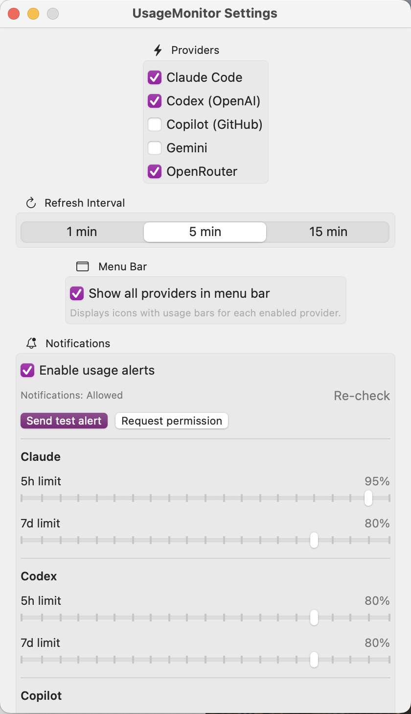

# UsageMonitor

UsageMonitor is a native macOS menu bar app that shows Claude, Codex, Copilot, Gemini, and OpenRouter usage at a glance.

[한국어 README](README.md)




## 1-Minute Install (Recommended)

```bash
git clone https://github.com/hichoe95/AI_Provider_Usage_monitor_for_mac.git
cd AI_Provider_Usage_monitor_for_mac
./Scripts/install_app.sh
```

`install_app.sh` does this automatically:
- release build
- create `UsageMonitor.app`
- copy to `/Applications` (or `~/Applications` if needed)
- remove quarantine attribute
- launch app

## First 30 Seconds Setup

1. Run provider login in the terminal on the same local Mac
2. Click menu bar icon -> `Settings...` -> enable providers you use
3. Click `Refresh Now` (⌘R)

CLI login commands differ by version, so check `--help`:

```bash
claude --help
codex --help
gh --help
gemini --help
```

## Notification Setup (Required)

1. Open menu bar icon -> `Settings...` -> `Notifications`
2. Turn ON `Enable usage alerts`
3. Click `Request permission`
4. Confirm status shows `Notifications: Allowed`
5. Click `Send test alert` and verify a real banner appears

If status is `Denied`, open macOS `System Settings -> Notifications -> UsageMonitor` and allow notifications.

Note: same-provider alerts use a 30-minute cooldown, so repeated alerts do not fire immediately.

## What You See in the Menu

- per-provider bars: `5h`, `7d`, and `sn` for Claude
- per-bar remaining time until reset (e.g. `2h 15m`, `3d 4h`)
- health dot (ok/error)
- trend arrow (`↑` / `↓`) vs previous refresh
- quick `Open Dashboard ↗` links
- last refresh time (`Updated ... ago`)

## Shortcuts

- `⌘R`: Refresh Now
- `⌘,`: Settings
- `⌘D`: Claude Dashboard
- `⌘Q`: Quit

## Requirements

| Item | Minimum |
|---|---|
| OS | macOS 14 or later |
| Xcode | 16 or later (includes Swift 6) |
| Git | Required |
| Network | Required for provider API requests |

Check environment:

```bash
swift --version
git --version
```

## Update

```bash
cd AI_Provider_Usage_monitor_for_mac
git pull
./Scripts/install_app.sh
```

## Changelog

### 2026-02-13 (Latest)

- Dropdown: removed `Sonnet Only` badge
- Dropdown: improved per-row remaining-time fallback for Codex/other providers
- Claude reset-time parsing hardened (epoch/ISO8601/fractional ISO8601)
- Added notification diagnostics in Settings (`Re-check`, `Request permission`, `Send test alert`)
- README: added required Notification Setup section
- README: replaced visuals with two latest screenshots
- Icon: removed opaque background and regenerated `UsageMonitor.icns`

<details>
<summary>2026-02-12 Changes (collapsed)</summary>

- release packaging updates
- fixed Swift 6 actor-isolation build errors
- fixed Codex auth error
- adjusted status bar length
- README updates

</details>

## Common Issues

### 1) Only `No data`

- make sure provider login exists on local Mac
- make sure app and terminal use the same macOS user account
- click `Refresh Now`

### 2) Repeated Keychain prompts

- choose `Always Allow` when prompted
- if you already chose `Allow`, update permissions in Keychain Access

### 3) OpenRouter not showing

- enable OpenRouter in Settings
- save API key
- click `Refresh Now`

### 4) `swift` not found

```bash
xcode-select --install
```

If needed, install Xcode 16+ and try again.

## Why Source Install Instead of DMG?

Downloaded DMG apps can be blocked by macOS Gatekeeper.
Local source build/install is the most reliable path for now.

## Development

```bash
swift build
swift test
./Scripts/package_app.sh
```

## License

MIT License
